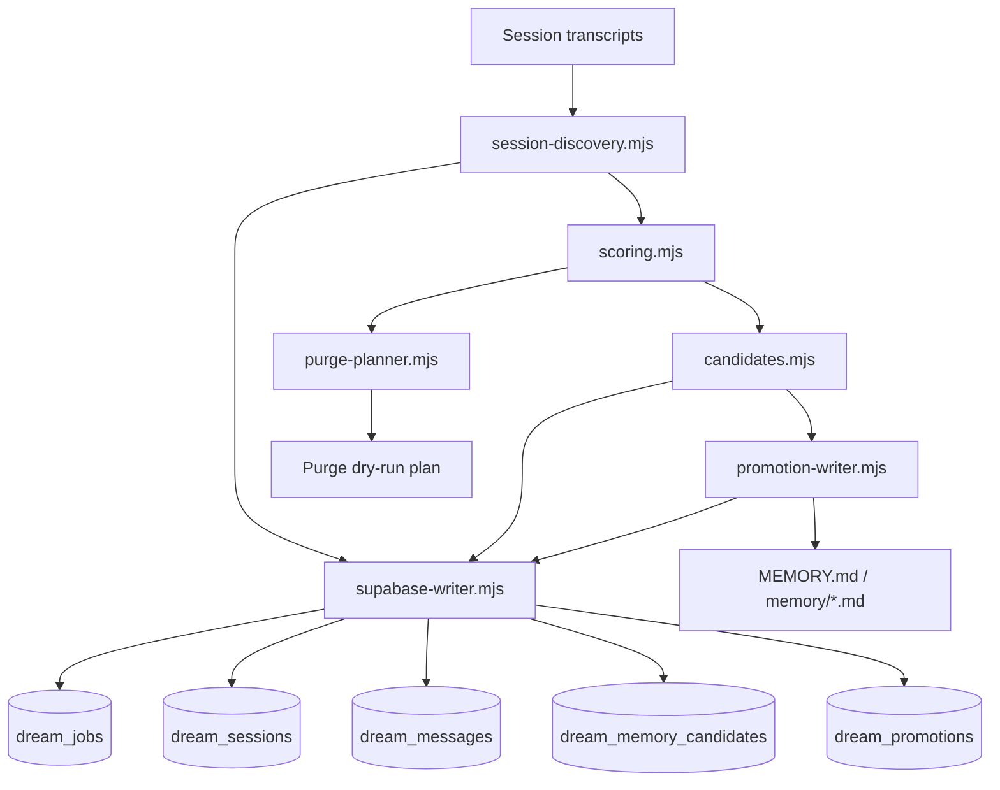
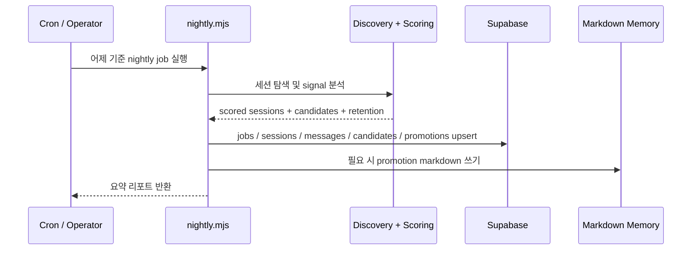

# 05_dream

`05_dream`은 OpenClaw 스타일의 에이전트 시스템을 위한 실험적 **dream-memory 파이프라인**입니다.

이 프로젝트는 하루치 세션/대화 기록을 바탕으로 밤마다 다음 흐름을 수행합니다.

1. 어제의 세션을 찾고,
2. 내용을 분석하고 점수화한 뒤,
3. 원본 세션 데이터를 Supabase에 archive하고,
4. 장기 기억 후보를 추출하고,
5. 사람이 읽을 수 있는 memory 파일로의 promotion을 계획하고,
6. retention / purge 후보를 계산합니다.

현재 상태는 의도적으로 **v0**입니다.

- batch-first
- audit-friendly
- replayable
- 완전한 지능형 판단보다 heuristic 중심
- 과한 자동화보다 운영자 제어를 우선

---

## 왜 이 프로젝트를 만들었나

많은 에이전트 메모리 시스템은 보통 셋 중 하나의 문제를 가집니다.

- 너무 많이 잊어버리거나
- 너무 많이 기억하거나
- 운영 로그/잡담/장기 기억을 한데 섞어버립니다

`05_dream`은 이 문제를 조금 더 보수적으로 다룹니다.

- **나중에 다시 볼 가치가 있는 원본은 먼저 archive**하고,
- **장기 기억으로 올릴 것은 더 엄격하게 고르고**,
- **최종 기억은 사람이 읽을 수 있게 유지**하고,
- **각 단계가 추적 가능하도록 설계**합니다.

이 접근은 다음과 같은 환경에 잘 맞습니다.

- 개인 AI assistant
- 운영자 감독형 agent system
- 장기 실행되는 chat agent의 memory 실험
- nightly reflection 스타일 파이프라인

---

## 핵심 아이디어

### 1) archive가 먼저다
고수준 요약을 신뢰하기 전에, 원본 세션 데이터가 먼저 보존되어야 합니다.

### 2) promotion은 archive보다 더 엄격해야 한다
어떤 세션은 raw archive로는 남길 가치가 있어도, 장기 기억으로 승격할 정도는 아닐 수 있습니다.

### 3) 운영 대화가 장기 기억을 오염시키면 안 된다
cron / 자동화 / low-user-signal 세션은 archive는 하되, promotion은 강하게 제한합니다.

### 4) Markdown은 여전히 중요한 최종 출력이다
장기 기억은 결국 `MEMORY.md`, `memory/*.md` 같은 사람이 읽을 수 있는 형식으로 남는 것을 목표로 합니다.

---

## 아키텍처



---

## Nightly flow



---

## 저장소 구조

```text
05_dream/
├─ README.md
├─ README-kr.md
├─ dream-memory.env.example
├─ docs/
│  ├─ dream-memory-system-v0.md
│  ├─ dream-memory-system-v0-checklist.md
│  └─ dream-memory-system-v0-supabase.sql
├─ scripts/
│  └─ dream-memory/
│     ├─ README.md
│     ├─ ENV_BRIDGE.md
│     ├─ nightly.mjs
│     └─ src/
│        ├─ candidates.mjs
│        ├─ config.mjs
│        ├─ date-window.mjs
│        ├─ memory-bootstrap.mjs
│        ├─ promotion-writer.mjs
│        ├─ purge-planner.mjs
│        ├─ scoring.mjs
│        ├─ session-discovery.mjs
│        ├─ supabase-writer.mjs
│        └─ text-cleaning.mjs
├─ supabase/
│  └─ dream_memory.sql
└─ LICENSE
```

---

## 현재 가능한 것

### 구현됨
- nightly runner (`nightly.mjs`)
- transcript 파일 기반 session discovery
- heuristic scoring 및 importance banding
- automation / cron / low-user-signal 억제
- candidate extraction
- Supabase raw archive persistence
- `dream_memory_candidates` 저장
- promotion planning / markdown generation 경로
- purge dry-run planning
- OpenClaw cron 검증

### 검증됨
- Supabase archive persistence 동작 확인
- candidate persistence 동작 확인
- cron 기반 nightly run 동작 확인
- `03_supabase/.env` 스타일 fallback bridge 동작 확인

### 아직 미완성
- production-grade promotion merge/replace 전략
- 실제 purge executor (현재는 dry-run만 지원)
- polished dashboard / query view
- 정교한 privacy / redaction policy
- real-time reflection / streaming memory update

---

## Supabase schema

이 프로젝트는 다음 테이블을 전제로 합니다.

- `dream_jobs`
- `dream_sessions`
- `dream_messages`
- `dream_memory_candidates`
- `dream_promotions`

스키마 초안은 아래 파일에 있습니다.

- `supabase/dream_memory.sql`

self-hosted Supabase env bridge 설명은 여기 있습니다.

- `scripts/dream-memory/ENV_BRIDGE.md`

---

## 로컬 실행

### 기본 실행

```bash
node scripts/dream-memory/nightly.mjs --date yesterday --dry-run=false --archive=true --purge=true
```

### 예시 플래그

```bash
node scripts/dream-memory/nightly.mjs \
  --date 2026-03-12 \
  --dry-run=false \
  --archive=true \
  --promote=false \
  --purge=true \
  --limit 10
```

### 주요 env

```bash
DREAM_SUPABASE_URL=...
DREAM_SUPABASE_SERVICE_ROLE_KEY=...
DREAM_ARCHIVE_TO_SUPABASE=true
DREAM_WRITE_PROMOTIONS=false
DREAM_PURGE_DRY_RUN=true
```

명시적인 `DREAM_SUPABASE_*` env가 없어도, 현재 구현은 self-hosted Supabase `.env` 레이아웃에서 값을 bridge할 수 있습니다.

---

## 오픈소스 포지셔닝

이 프로젝트는 다음을 원하는 사람에게 잘 맞습니다.

- inspectable memory pipeline
- 단순한 file-based transcript ingestion
- Supabase 기반 archival storage
- 보수적인 long-term memory promotion
- agent-memory 실험을 위한 기반 코드

반대로 이 프로젝트는 아직 다음을 목표로 하지는 않습니다.

- 범용 vector memory framework
- full knowledge graph
- real-time autonomous reflection engine
- 완성형 end-user product

---

## 로드맵

### 단기
- promotion 품질과 dedupe 개선
- `dream_promotions` 활용 강화
- 더 안전한 purge execution flow 추가
- false positive 검토 툴링 개선

### 중기
- memory merge / replace 전략 고도화
- query view 또는 lightweight admin UI
- 선택적 redaction / sensitivity policy
- 다른 transcript source용 adapter 확장

---

## 개발 메모

이 저장소에는 현재 다음이 포함되어 있습니다.

- 설계 문서
- 동작하는 프로토타입 코드
- 스키마 초안
- contributor가 이해할 수 있는 프로젝트 컨텍스트

---

## 라이선스 / 상태

MIT License를 사용합니다.

다음 단계로는 roadmap issue 정리, project board 구성, contributor 문서 보강이 자연스럽습니다.
